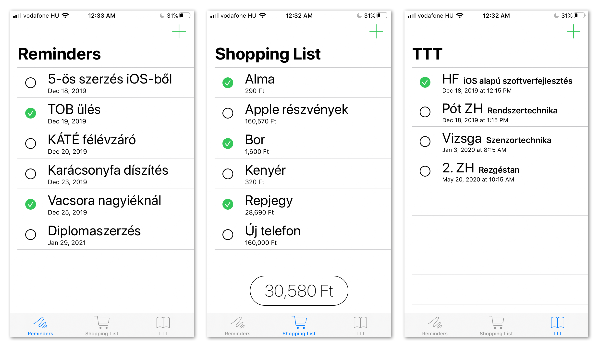
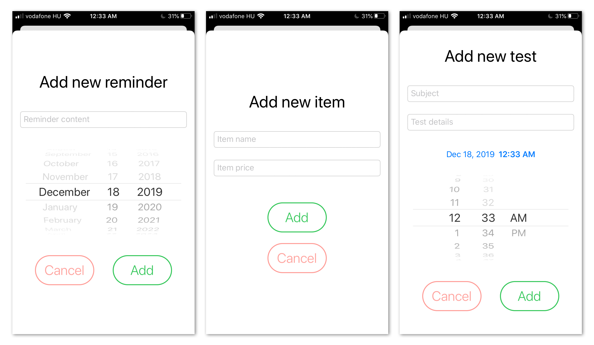
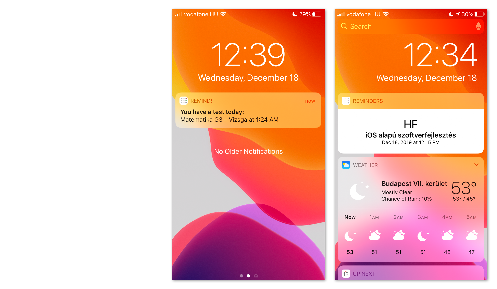
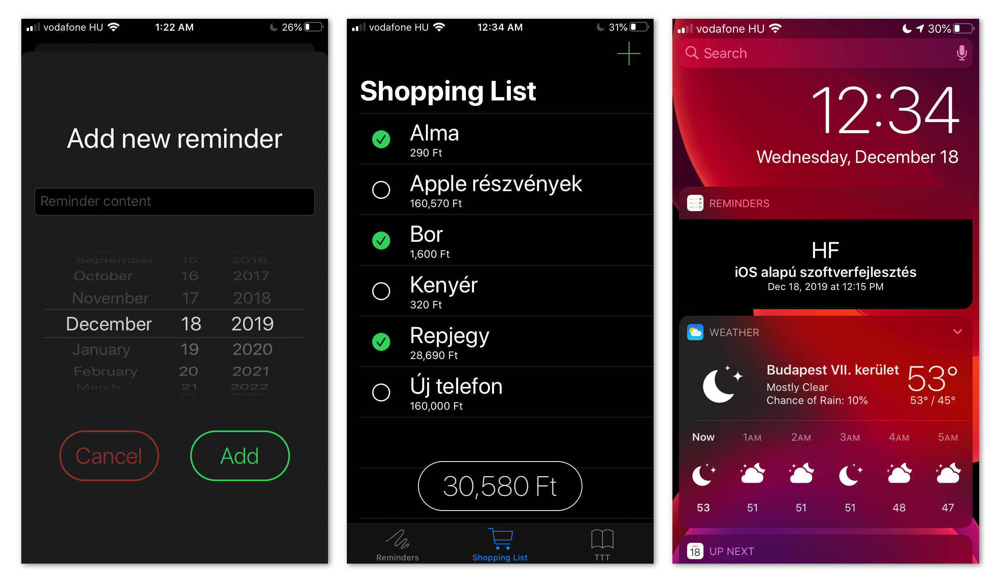

# Remind!
`iOS` alapú szoftverfejlesztés házi feladat. Készítette: Hepp Ádám Attila – IE195R

## Az applikáció funciói és felépítése
Az elészült alkalmazás egy emlékeztetőkezelő applikáció. Három különböző típusban lehet tételeket létrehozni és tárolni:
* Klasszikus emlékeztető tétel címmel és határidő dátummal
* Bevásárló lista a tételek nevével és árával
* Tanulmányi Teljesítményértékelési Terv – számonkérések, dolgozatok típusa, a tárgy neve és a pontos időpont

A különböző alaptípusokhoz egy-egy tab tartozik. Minden tételnél megjelölhető, hogy elkészült-e, és minden tétel törölhető. Hozzáadni a jobb felső sarokban (`navigationBarItems(trailing:)`) lévő gomb segítségével lehet.

Az dátumot is tároló tételekhez az alkalmazás értesítéseket állít be. Az emlékeztetők esetén a megadott napon reggel 9 órakor, a számonkérések esetén a megadott idő előtt 45 perccel kapunk értesítést. Amennyiben törlünk egy tételt, úgy az ahhoz tartozó egyedileg azonosított `Notification Request` is törlődik. Minden adat egy közös, `App Group`-hoz tartozó megosztott `Core Data` stack-ben tárolódik, így lehetőség van `Today Widget` megjelenítésére, mely a soron következő, még le nem zajlott számonkérés adatait jeleníti meg a `Notification Center`-ben.

Az egész alkalmazás `SwiftUI` használatával készült, beleértve a `Today Widget` tartalmi megjelenítését is. Így a létrehozott alkalmazás használható minden `iOS 13`-at futtató készüléken, és alapértelmezetten támogatja a `Dark Mode` megjelenést is.

### Megvalósított feature-ök
* `Core Data`
* `SwiftUI`
* `Notification`
* `App Extension`
